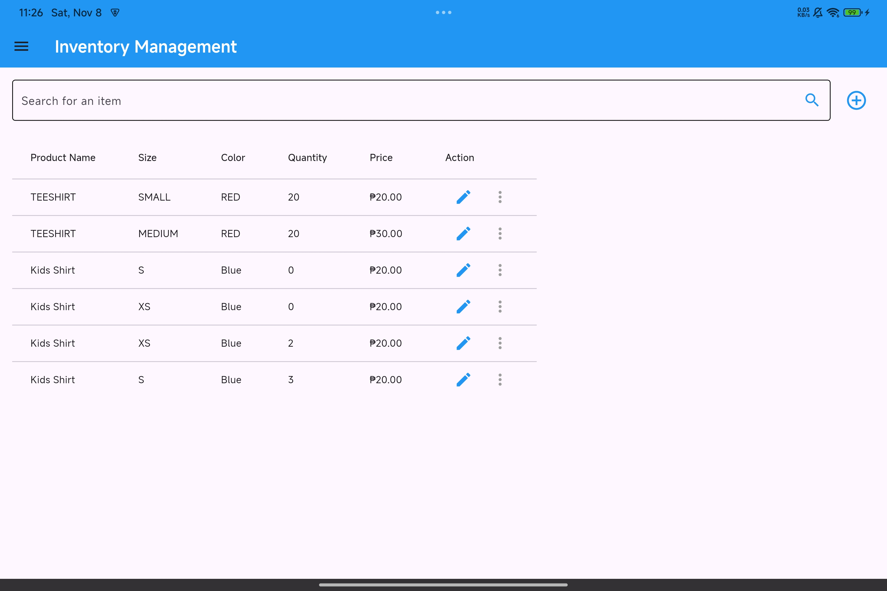
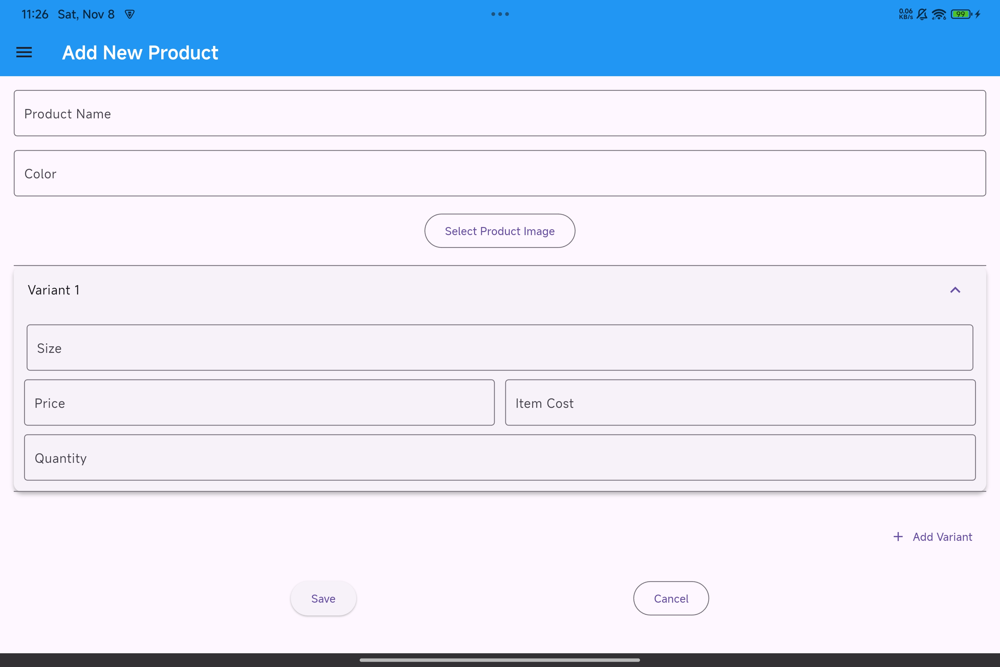
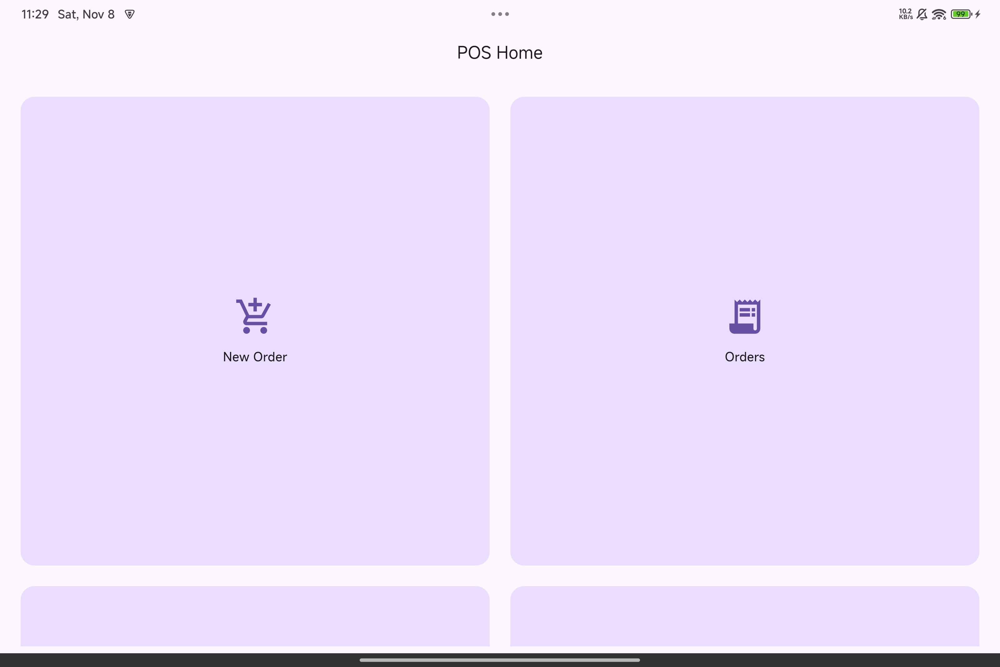
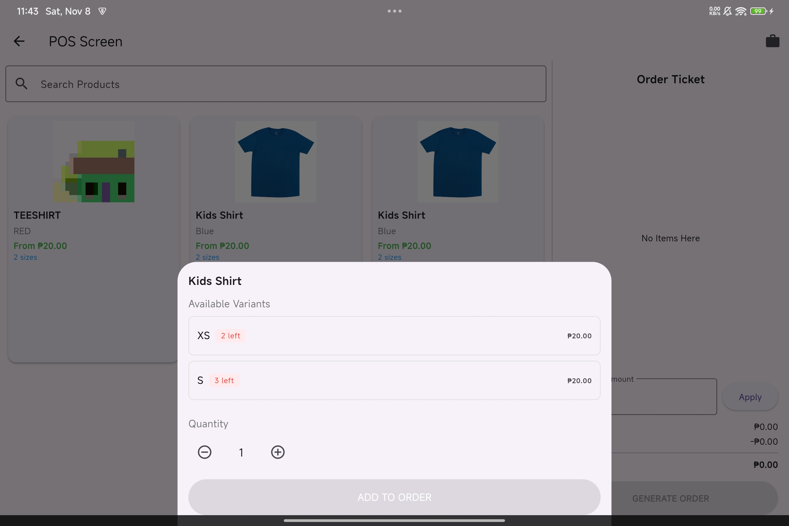

## 🚧 Project Status
This project is currently under development.  
Planned next steps:
- Add authentication and user roles
- Improve API documentation
- Add sales record
- Create Dashboard
- Include customer details form
-  Delete T-shirts from inventory
-  Edit product stocks 

# 👕 T-shirt Inventory Management

A simple inventory management system designed for **ENY Prints**, a T-shirt printing business.  

This project includes:
- A **REST API** built with **FastAPI** and **SQLAlchemy** (currently deployed online)
- A **Flutter frontend** for managing inventory (currently under local development)

The system allows ENY Prints to track T-shirt stock using SKUs, record sales, and manage daily inventory operations efficiently.

---

## 🚀 Live API

You can access the deployed API here:  
👉 **[https://tshirt-inventory.onrender.com](https://tshirt-inventory.onrender.com)**

### Available Endpoints:
| Service | URL |
|----------|-----|
| 🧾 API Root | [https://tshirt-inventory.onrender.com](https://tshirt-inventory.onrender.com) |
| 🏷️ Products | [https://tshirt-inventory.onrender.com/products](https://tshirt-inventory.onrender.com/products) |
| 📦 Orders | [https://tshirt-inventory.onrender.com/orders](https://tshirt-inventory.onrender.com/orders) |
| 💰 Order Payments | [https://tshirt-inventory.onrender.com/order-payments](https://tshirt-inventory.onrender.com/order-payments) |
| 💵 Total Payments | [https://tshirt-inventory.onrender.com/total-payments](https://tshirt-inventory.onrender.com/total-payments) |
| 👤 User Info | [https://tshirt-inventory.onrender.com/user-info](https://tshirt-inventory.onrender.com/user-info) |
| 🛠️ Service | [https://tshirt-inventory.onrender.com/service](https://tshirt-inventory.onrender.com/service) |

---

## 🧩 Features

- Add new T-shirts with detailed SKU information  
- Update existing T-shirt stock levels  
- View all T-shirts in inventory  
- Uses **PostgreSQL** as the database backend  
  

---

## ⚙️ Technologies Used

- **Python 3.11+**  
- **FastAPI** (for API endpoints)  
- **SQLAlchemy** (ORM for database interaction)  
- **PostgreSQL** (database)  
- **Uvicorn** (ASGI server)

---

1. Clone the repository:  
   ```bash
   git clone https://github.com/waemsiey/tshirt-inventory.git
   cd tshirt-inventory
2. Create and activate a Python virtual environment:
      python -m venv venv
      On Windows PowerShell:
   ```bash
           \venv\Scripts\activate
   
3. Install the virtual environment
   ```bash
     pip install -r requirements.txt

4. Set up postgres database

5. Run the FastAPI application
   ```bash
    uvicorn app.main:app --reload

   
### API Overview

**INVENTORY PRODUCTS** 
#


#


**ORDERS**  
#

#

#



